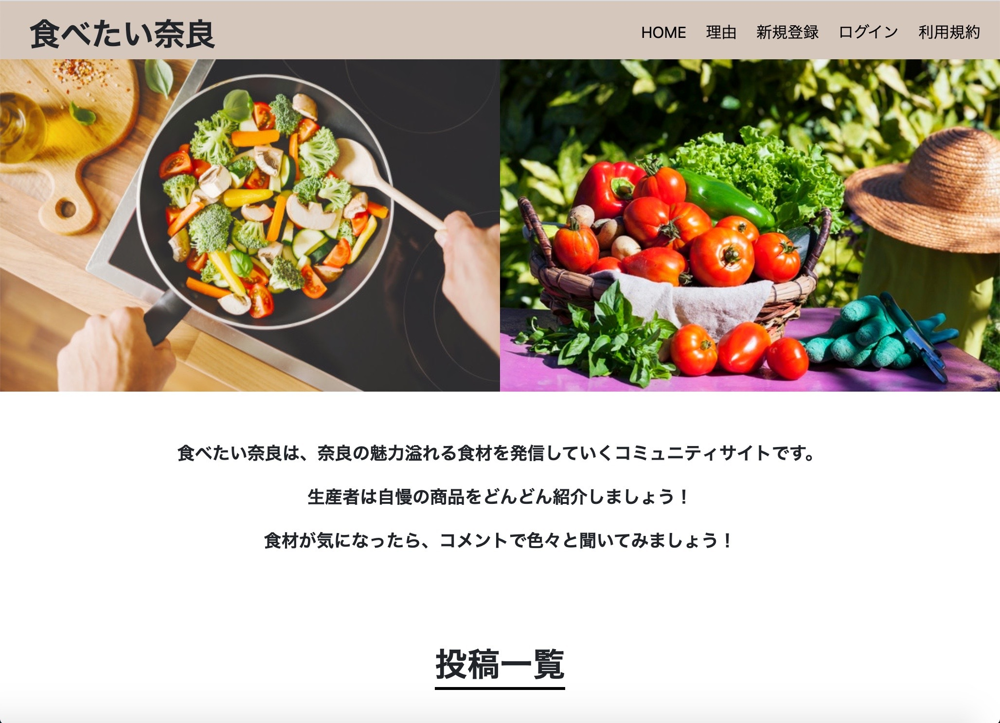

<h1 align="center">食べたい奈良</h1>

## アプリケーションの概要
生産者さんと消費者さんに別れて、コミュニケーションをとる事を目的としています。

## App URL

### **https://tabetai-nara.herokuapp.com/** 
##### テストユーザーID：nara@tarou.com
##### テストユーザーPASS：111aaa

## アプリケーションの利用方法
このアプリケーションでは、生産者と消費者に分けてユーザー登録を行います。  
生産者はproductを作成し、自分の生産物の詳細を投稿できます。  
そのproductに対して、コメント機能を用いて生産者と消費者でコミュニケーションをとる事ができます。

## 目指した課題解決
奈良の地場の生産者さんと、消費者さんとが繋がりやすい様なアプリを開発し奈良の一次産業を盛り上げていきたいと言う思いからです。  
- 生産者さんのペルソナ  
  - 性別：男性  
  - 年齢：40歳〜  
  - 住所：奈良  
  - 抱えている問題
    - webにあまり強くなく、難しい操作は出来るだけ省きたい。
    - 生産物の詳細を知らせられる場所が少ない。 
    
- 消費者さんのメインペルソナ
  - 職業：料理人
  - 性別：男性
  - 年齢：30〜50代
  - 住所：近畿
  - 消費行動：週1〜2回の仕入れ
  - 抱えている問題
    - 仕入れや下調べにあまり時間をかけたくない。
    - 生産物の詳細を確認する事ができる。
    - アウトレット品などがあるかどうか。
    
- 消費者さんのサブペルソナ
  - 職業：主に主婦
  - 性別：女性
  - 年齢:30代〜
  - 住所：近畿
  - 家族構成：2〜4人
  - 消費行動：週2〜3回の買い物
  - 抱えている問題
    - 食べるものの安全性を知りたい。
    - アウトレット品があるかどうか。
    - コミュニケーションで、レシピなどが知りたい。
    
## 洗い出した要件  

| 優先順位（高：3、中：2、低：1） | 機能 | 目的 | 詳細 | ユースケース | 見積もり（時間） | その他 |
| --- | --- | --- | --- | --- | --- | --- |
| 3 | ユーザー登録機能 | ユーザーを登録、管理するため | 生産者と消費者にわけて登録できる様にする | ・生産者として、ユーザー登録ができる  ・消費者として、ユーザー登録ができる | 8時間 | 実装済み |
| 3 | product投稿機能 | どの様な生産物を作っているか見える様にするするため | 生産物の詳細を記述する事で、どの様なこだわりを持って作っているのかを知らせる事ができる | ・生産者のみが行える  ・新規投稿ページに移動し、各項目を入力する事により新規productとして投稿する事ができる | 8時間 | 実装済み |
| 1 | product編集機能 | 生産物に変化があれば、更新するできる様にするため | 編集機能だが、コメントに逐一新しい情報を載せていければいいかとも考えているので、重要度は低い | ・生産者のみが行える  ・product編集ページ内で、各項目を編集し更新する事ができる | 8時間 | 未実装 |
| 2 | product削除機能 | 収穫や出荷が終わった生産物があれば、残しておかずに削除して整理をするため | DBより不要な部分を削除できる様にする | ・生産者のみが行える  ・product詳細ページに移動し、削除ボタンを押す事で該当のproduct情報をDBより削除する事ができる | 2時間 | 実装済み |
| 3 | コメント機能 | 生産者と消費者がコミュニケーションをとるため | 生産者と消費者がお互いにコミュニケーションをとる事で、生産者さんは自分の生産物をアピールできるし、消費者さんは、気になっている生産物がどう言う状態で作られているのかを知る事ができる | ・生産者、消費者共に行える  ・product詳細ページより、コメント投稿フォームに内容を記入する事で投稿する事ができる  ・画像もコメントに付与して投稿できる様にする予定 | 8時間 | 実装済み |
| 1 | お気に入り機能 | 気に入った生産物をを毎回探さなくてよくするため | お気に入りとして取りおける | ・数点投稿されている事が前提  ・お気に入り登録をした投稿は、ユーザーページに保管される | 4時間 | 未実装 |
| 2 | 検索機能 | 生産物や生産者を探せる様にするため | 生産者名や、product名で検索する事ができる | ・数点投稿されている事が前提  ・条件に該当する検索結果を、一覧で表示される | 8時間 | 未実装 |

## 実装した機能について

## データベース設計

## テーブル設計

### usersテーブル

| Column                | Type    | Options                   |
| --------------------- | ------- | ------------------------- |
| nickname              | string  | null: false               |
| email                 | string  | null: false, unique: true |
| encrypted_password    | string  | null: false               |
| state_id              | integer | null: false               |

#### Association

- has_many :products
- has_many :comments

### productsテーブル

| Column                | Type       | Options                         |
| --------------------- | ---------- | ------------------------------- |
| product_name          | string     | null: false                     |
| brand                 | string     | null: false                     |
| origin_id             | integer    | null: false                     |
| text                  | text       | null: false                     |
| user                  | references | null: false, foreign_key: true  |

#### Association

- belongs_to :user
- has_many :comments

### commentsテーブル

| Column                | Type       | Options                         |
| --------------------- | ---------- | ------------------------------- |
| text                  | text       | null: false                     |
| user                  | references | null: false, foreign_key: true  |
| product               | references | null: false, foreign_key: true  |

#### Association

- belongs_to :user
- belongs_to :product

## ローカルでの動作方法
$ git clone https://github.com/mitsu-yama86/Tabetai-NARA.git
 $ cd Tabetai-NARA
 $ bundle install
 $ rails db:create
 $ rails db:migrate
 $ rails s
 👉 http://localhost:3000
